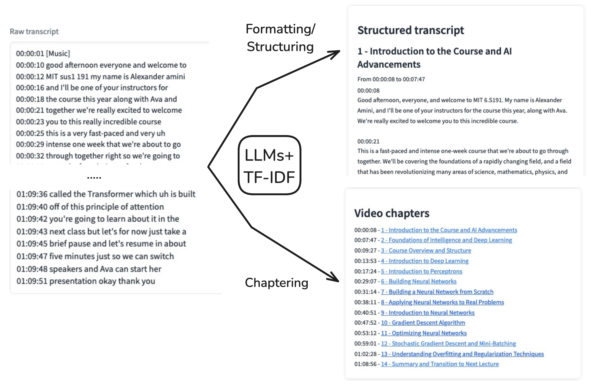
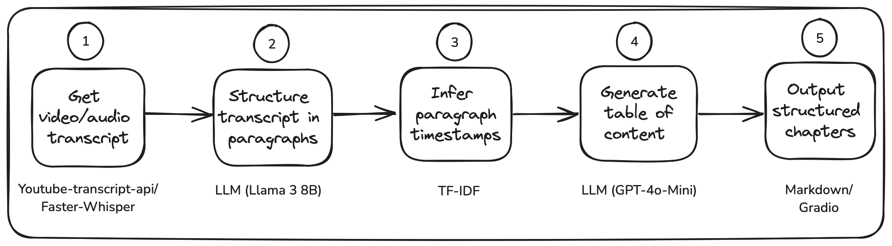

# Automatic video chaptering with LLMs and TF-IDF

This repository contains code for generating chapters for a video using a combination of LLMs and TF-IDF. See [main notebook](video_chapter_generator.ipynb).

Associated Medium article [here](https://medium.com/@ya-lb/using-claude-3-to-transform-a-video-tutorial-in-a-blog-post-d2c1e04e7a7b).

Examples on HuggingFace Space:
- [https://huggingface.co/spaces/Yannael/video-chaptering](https://huggingface.co/spaces/Yannael/video-chaptering)

### From raw transcript to structured document

### Workflow

